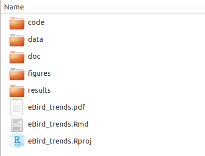

```{r setup, include=FALSE}
knitr::opts_chunk$set(echo = TRUE)
```

## Setting up a workflow
- [R projects](https://support.rstudio.com/hc/en-us/articles/200526207-Using-Projects)
- [Git](https://git-scm.com/docs/gittutorial) & [GitHub](https://guides.github.com/activities/hello-world/)
- Folder management system
  
  
  
- Annotated code
- Use relative file paths

## Loading data

- [readr](https://cran.r-project.org/web/packages/readr/README.html) for flat files (.csv, .txt)
- [readxl](https://blog.rstudio.org/2015/04/15/readxl-0-1-0/) for Excel spreadsheets
- [RODBC](https://cran.r-project.org/web/packages/RODBC/RODBC.pdf) for many types of databases
- [RPostgreSQL](http://www.r-bloggers.com/getting-started-with-postgresql-in-r/) for PostgreSQL databases
- [googlesheets](https://cran.r-project.org/web/packages/googlesheets/googlesheets.pdf) for interacting with Google sheets
- ... and many, many more

## Tidy data

[*Tidy datasets are all alike but every messy datset is messy in its own way*](http://vita.had.co.nz/papers/tidy-data.html)

- Tidy data:
    + Observations in rows
    + Variables in columns
    + Each type of observational unit is a table
    
- Messy data:

    + Column headers are values, not variable names
    + Multiple variables stored in one column
    + Variables stored in both rows and columns
    + Multiple observational unit types in the same table
    + Single observational unit in multiple tables
    
## Data tidying and manipulation tools

- [tidyr](https://blog.rstudio.org/2014/07/22/introducing-tidyr/): `gather()`, `separate()`, `spread()`
- [plyr](http://seananderson.ca/2013/12/01/plyr.html): split-apply-combine, `ldply()`
- [dplyr](https://cran.rstudio.com/web/packages/dplyr/vignettes/introduction.html): `group_by()`, `filter()`, `summarise()`, `mutate()`, `arrange()` 
- [Swirl](http://swirlstats.com/) provides tutorials for tidyr and dplyr directly in the R console

## Messy output
```{r lin_mod}
data("mtcars")
lmfit <- lm(mpg ~ wt, mtcars)
summary(lmfit)
```

## Tidy output tools

- [broom](https://cran.r-project.org/web/packages/broom/vignettes/broom.html): `tidy()`, `glance()`, `augment()`

```{r broom_tidy}
library(broom)
tidy(lmfit)
```

```{r broom_glance}
glance(lmfit)
```

## Plotting

- [ggplot](http://www.cookbook-r.com/Graphs/) is designed to work with tidy data formats

```{r ggplot_example, message=FALSE, fig.height=2.5}
library(ggplot2)
library(cowplot)
ggplot(mtcars, aes(x = wt, y = mpg)) + 
  geom_point() + 
  facet_wrap(~gear) + 
  geom_smooth(method = "lm")
```

## [RMarkdown](http://rmarkdown.rstudio.com/)
- Markdown + [knitR](http://yihui.name/knitr/) + pandoc
- Outputs to PDF, Word, HTML, notebooks ...
- Contains R code chunks
- Dynamic log of analysis
- Reasonably simple syntax (and lots of online resources)


